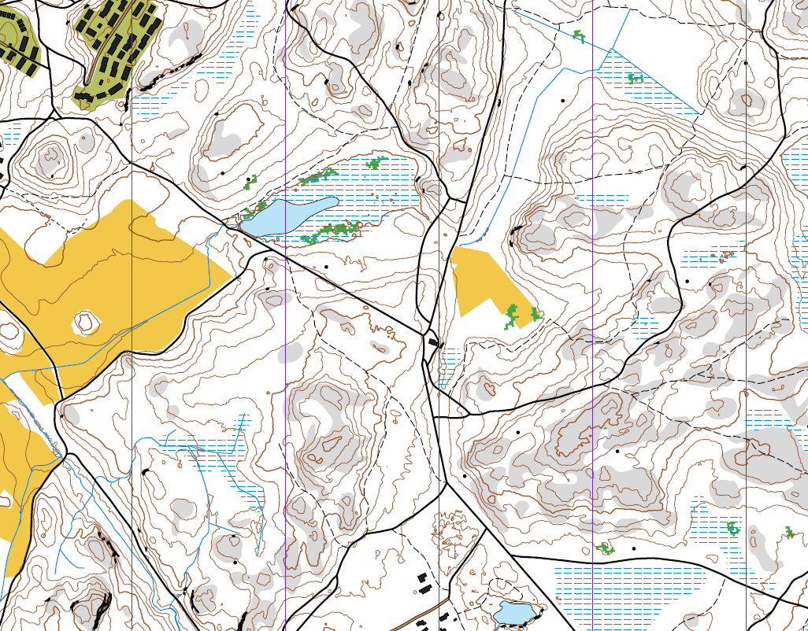

# mml-omap



Generate orienteering-oriented maps from Maanmittauslaitos vector data and
laser scanning point clouds.

The normal workflow is one command: download MML topographic vector data,
download the covering 0.5 p LAZ map sheets, build the terrain model from the
point cloud, then write GeoJSON, PNG, PDF, a LiDAR diagnostic PNG, and a terrain
report. Rendered maps use the smallest A5, A4, or A3 portrait/landscape page
that fits the requested map frame at the requested scale.

Coordinates are ETRS-TM35FIN / EPSG:3067 meters, matching the native MML file
service output.

## Install

From a local checkout:

```sh
uv sync
uv run mml-omap --help
```

Run tests:

```sh
uv run python -m unittest discover -s tests
```

## API Key

The combined build downloads data from MML Paikkatiedon tiedostopalvelu OGC API
Processes, so it needs an MML API key.

Create a key with MML's instructions:

- https://www.maanmittauslaitos.fi/rajapinnat/api-avaimen-ohje
- https://avoin-paikkatieto.maanmittauslaitos.fi/tiedostopalvelu/ogcproc/v1/

Set the key in the shell:

```sh
export MML_API_KEY="your-api-key"
```

Or put it in a local `.env` file in the repository root:

```sh
MML_API_KEY=your-api-key
```

Do not commit `.env`.

## Inputs

`mml-omap build` combines data sources for the same EPSG:3067 map frame:

- MML vector data downloaded automatically from `maastotietokanta_bbox`.
- MML 0.5 p laser scanning data downloaded automatically from
  `laserkeilausaineisto_05_karttalehti`.

## Espoon Keskuspuisto Example

This 1:10000 example is centered on Espoon keskuspuisto at
`60.1880680, 24.6967986`. The bbox is `371255,6673869,373305,6675299` in
EPSG:3067 meters.

All generated files go under `builds/examples/espoo-keskuspuisto/`, which is
easy to gitignore or delete.

```sh
uv run mml-omap ekp
```

The command writes:

- `builds/examples/espoo-keskuspuisto/espoo-keskuspuisto-1m.geojson`
- `builds/examples/espoo-keskuspuisto/espoo-keskuspuisto-1m.png`
- `builds/examples/espoo-keskuspuisto/espoo-keskuspuisto-1m.pdf`
- matching `espoo-keskuspuisto-2_5m.*` and `espoo-keskuspuisto-5m.*` outputs
- `builds/examples/espoo-keskuspuisto/espoo-keskuspuisto-lidar-points.png`
- `espoo-keskuspuisto-1m-terrain-report.json`,
  `espoo-keskuspuisto-2_5m-terrain-report.json`, and
  `espoo-keskuspuisto-5m-terrain-report.json`
- `builds/examples/espoo-keskuspuisto/downloads/`

## Kotka-Jukola Example

This 1:10000 example is centered around Kymi airfield and covers part of
the Kotka-Jukola 2026 harjoituskieltoalue shown on the event site. The bbox is
`492900,6713000,495700,6717100` in EPSG:3067 meters.

All generated files go under `builds/examples/kotka-jukola/`.

```sh
uv run mml-omap kotka-jukola
```

The command writes `kotka-jukola-1m.*`, `kotka-jukola-2_5m.*`, and
`kotka-jukola-5m.*` map outputs, one shared
`kotka-jukola-lidar-points.png`, terrain reports, and the source downloads.

## Puijo Example

This 1:10000 example is around Puijon torni and fits on A4 portrait. The bbox
is `532322,6974301,534322,6977101` in EPSG:3067 meters.

```sh
uv run mml-omap puijo
```

The command writes `puijo-1m.*`, `puijo-2_5m.*`, and `puijo-5m.*` map outputs,
one shared `puijo-lidar-points.png`, terrain reports, and the source downloads
under `builds/examples/puijo/`.

## Vuokatinvaara Example

This 1:10000 example is around Vuokatinvaara and fits on A4 portrait. The bbox
is `560649,7112274,562649,7115074` in EPSG:3067 meters.

```sh
uv run mml-omap vuokatinvaara
```

The command writes `vuokatinvaara-1m.*`, `vuokatinvaara-2_5m.*`, and
`vuokatinvaara-5m.*` map outputs, one shared
`vuokatinvaara-lidar-points.png`, terrain reports, and the source downloads
under `builds/examples/vuokatinvaara/`.

## What It Generates

The build output combines:

- MML vector objects: paths, roads, water, marshes, open-land proxies,
  buildings, fences, rocks, MML cliff vectors, and other mapped features.
- Point-cloud contours: generated from a continuous ground grid built from
  classified LAZ ground points.
- Point-cloud cliff candidates: generated from steep slope bands in the same
  ground grid.
- Point-cloud vegetation: generated from above-ground point density into ISOM
  `406`/`410` candidate polygons.
- A magnetic-north paper frame with map layout metadata in PNG/PDF output.

The point cloud is downloaded for a slightly larger terrain context bbox and
the final generated features are clipped back to the requested map frame.

## Coordinate System

`EPSG:3067` is Finland's standard projected map coordinate system,
`ETRS-TM35FIN`. Coordinates are metric easting/northing values, not
latitude/longitude degrees.

`mml-omap` treats the bbox as the intended paper map frame. It expands the MML
download bbox as needed for magnetic-north rotation, clips output geometry back
to the paper frame, and renders magnetic north upward.

Automatic magnetic correction is a lightweight Finland-only estimate of MML's
`KOK = NEK + NAK`. Use `--magnetic-declination-deg` when you have an
authoritative local value.

The current automatic `NEK` estimate is:

```text
decimal_year = year + day_of_year_elapsed / days_in_year
x = longitude_degrees - 25.0
y = latitude_degrees - 62.0

NEK_degrees =
  11.071507931
  + 0.432817643 * x
  + 0.378133772 * y
  + 0.20 * (decimal_year - 2026.0)
```

`NAK` is calculated as meridian convergence in ETRS-TM35FIN:

```text
NAK_degrees = atan(tan(longitude - 27 degrees) * sin(latitude))
KOK_degrees = NEK_degrees + NAK_degrees
```

The formula is approximate and not an official MML/FMI Erantokartta model.

The same model as a rough Finland heatmap:


## Documentation Map

- [docs/mml-to-isom-mapping.md](docs/mml-to-isom-mapping.md) documents MML
  tables, `kohdeluokka` handling, and ISOM symbol mapping.
- [docs/pipeline.md](docs/pipeline.md) documents the build pipeline, terrain
  model, generated features, algorithms, and known gaps.
- [docs/isom-symbol-library.md](docs/isom-symbol-library.md) documents the
  built-in symbol definitions and renderer contract.

Export the built-in symbol library as JSON:

```sh
uv run mml-omap symbols symbols.json
```

## Notes

Generated GeoJSON is public interchange data, not a proprietary map project.
Maanmittauslaitos data licensing and attribution requirements still apply to
downloaded data.

Generated map files can be large. `.gitignore` excludes local build output,
download archives, GeoPackages, rendered maps, caches, virtual environments,
and `.env` files.
