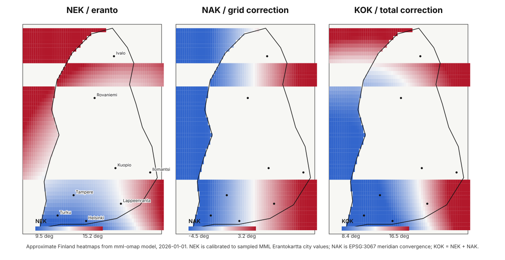

# mml-omap

Generate orienteering-oriented map data and map previews from
Maanmittauslaitos open topographic data. The goal is to make actual
orienteering maps, plus useful intermediate GeoJSON files, from MML data alone.

This is still alpha software. It can already download MML data, convert selected
features to symbolized GeoJSON, and render simple SVG/PNG/PDF previews. It is
not yet a complete ISOM/ISSprOM-quality cartographic production tool.

The tool is intentionally small:

- Uses MML's Paikkatiedon tiedostopalvelu OGC API Processes endpoint.
- Submits `maastotietokanta_bbox` jobs.
- Downloads the returned GeoPackage package.
- Converts selected GeoPackage feature tables to GeoJSON.
- Adds optional `symbol` and `object_type` properties.
- Renders GeoJSON to SVG, PNG, or PDF.
- Supports magnetic-north-oriented paper frames for rendered maps.
- Uses only the Python standard library.

Coordinates are ETRS-TM35FIN / EPSG:3067 meters, matching the native MML file
service output.

## Coordinate System

`EPSG:3067` is the EPSG registry code for Finland's standard projected map
coordinate system, `ETRS-TM35FIN`. In practice, this means coordinates are
stored as metric `E,N` values instead of latitude/longitude degrees. The `E`
coordinate is easting in meters and the `N` coordinate is northing in meters.

`ETRS-TM35FIN` means:

- `ETRS` refers to the European Terrestrial Reference System, the geodetic
  reference frame used for the coordinates.
- `TM35` means Transverse Mercator zone 35, using 27 degrees east as the central
  meridian.
- `FIN` is the Finnish national realization of that projected coordinate system.

MML topographic data is delivered in this coordinate system, so `mml-omap`
keeps GeoJSON coordinates in EPSG:3067 meters.

## Data Sources And Coverage

Today, `mml-omap` uses only the GeoPackage returned by MML's
`maastotietokanta_bbox` process from Paikkatiedon tiedostopalvelu. It does not
currently download or process MML laser scanning point clouds, elevation models,
hillshade rasters, aerial imagery, forest inventory rasters, or other raster
products.

That means the current output is useful as a generated base map and as
intermediate GeoJSON, but it is not enough by itself for a finished,
field-checked orienteering map. Real orienteering maps usually need better
contour generation, vegetation runnability interpretation, generalization,
symbol conflict handling, and human cartographic review.

Current source usage by feature type:

- Contours: read from the MML topographic database GeoPackage table
  `korkeuskayra` and rendered as `contour`. The tool does not currently derive
  contours directly from laser scanning data or an elevation model.
- Vegetation: not meaningfully generated yet. Some open or semi-open land-cover
  tables such as `maatalousmaa`, `niitty`, `muuavoinalue`, and `puisto` are
  mapped as `field`, and `kallioalue` is mapped as `open_rock`.
  `urheilujavirkistysalue` is kept as `recreation_area` in the GeoJSON but is
  not painted by the default renderer because it can describe a broad
  sports/recreation land-use area rather than actual open runnable land.
  Forest vegetation and runnability need future source mapping or raster
  analysis.
- Lakes and bodies of water: read from `jarvi` and `meri`, mapped as `lake`.
- Streams and rivers: narrow streams are read from `virtavesikapea` and mapped
  as `stream`; wider water areas are read from `virtavesialue` and mapped as
  `river`.
- Swamps: read from `suo` and `soistuma`, mapped as `swamp`.
- Cliffs: read from `jyrkanne`, mapped as `cliff`. The tool does not currently
  infer cliffs from slope, laser scanning, or elevation models.
- Roads: read from `tieviiva`. Selected `kohdeluokka` values are mapped as
  `road`.
- Paths: read from `tieviiva`. Selected `kohdeluokka` values are mapped as
  `path`.
- Forest density: not currently generated. No laser-scan, canopy, forest
  inventory, or vegetation-density raster is processed.
- Buildings and other human-built objects: `rakennus` is mapped as `building`,
  `rakennusreunaviiva` as building linework, and `aita` as `fence`. Other
  human-made features require more table mappings.
- Rocks: `kivi` is mapped as `mapped_rock`. The tool does not currently infer
  boulders or rocky ground from laser scanning or imagery.

## Orientation And Size

MML's `boundingBoxInput` is an axis-aligned rectangle in EPSG:3067 coordinates.
That is not the same thing as the rectangle printed on an orienteering map when
the map is oriented to magnetic north.

In `mml-omap`, `--bbox` is treated as the intended paper map frame. By default,
the tool estimates the MML-style total compass correction from the map center
and date, expands the MML download request to the smallest EPSG:3067 bbox that
contains that rotated paper frame, clips output geometry back to the rotated
frame, then renders the paper frame with magnetic north pointing up.

MML's Erantokartta separates this into `NEK` (magnetic declination, or eranto),
`NAK` (grid/projection north correction, or napaluvun korjaus), and `KOK`
(total correction), where `KOK = NEK + NAK`. Because this tool works in
EPSG:3067 grid coordinates, automatic map rotation uses a lightweight
Finland-only estimate of `KOK`, not just `NEK`. The authoritative MML service
calculates values for 12 km x 12 km map-sheet centers from Finnish
Meteorological Institute data:
https://www.maanmittauslaitos.fi/kartat-ja-paikkatieto/kartat/erantokartta

Pass `--magnetic-declination-deg 10.5` when you want to use an authoritative
local value manually. Use `--magnetic-date YYYY-MM-DD` to calculate the automatic
estimate for a specific date; otherwise the current date is used.

The current automatic `NEK` estimate is deliberately simple:

```text
decimal_year = year + day_of_year_elapsed / days_in_year
x = longitude_degrees - 25.0
y = latitude_degrees - 62.0

NEK_degrees =
  11.071507931
  + 0.432817643 * x
  + 0.378133772 * y
  + 0.20 * (decimal_year - 2026.0)
```

The tool converts the EPSG:3067 map center to WGS84 latitude/longitude before
using this formula. It then calculates `NAK` as meridian convergence in
ETRS-TM35FIN:

```text
NAK_degrees = atan(tan(longitude - 27 degrees) * sin(latitude))
KOK_degrees = NEK_degrees + NAK_degrees
```

The formula above is only a rough Finland-wide approximation. It is a
least-squares plane calibrated to sampled MML Erantokartta values at the
beginning of 2026 for Helsinki, Turku, Lappeenranta, Kuopio, Ilomantsi,
Rovaniemi, and Ivalo. It intentionally does not interpolate every sample point,
and it is not the official MML/FMI Erantokartta model.

Example `NEK` values from the current formula for the beginning of 2026:

| City | Approximate WGS84 center | Model NEK | Erantokartta sample | Residual |
| --- | --- | ---: | ---: | ---: |
| Helsinki | 60.1699 N, 24.9384 E | 10.35 deg | 9.84 deg | +0.51 deg |
| Turku | 60.4518 N, 22.2666 E | 9.30 deg | 9.89 deg | -0.59 deg |
| Tampere | 61.4978 N, 23.7610 E | 10.35 deg | | |
| Kuopio | 62.8924 N, 27.6770 E | 12.57 deg | 12.27 deg | +0.30 deg |
| Lappeenranta | 61.0587 N, 28.1887 E | 12.10 deg | 12.17 deg | -0.07 deg |
| Ilomantsi | 62.6716 N, 30.9328 E | 13.89 deg | 14.17 deg | -0.28 deg |
| Rovaniemi | 66.5039 N, 25.7294 E | 13.09 deg | 12.64 deg | +0.45 deg |
| Ivalo | 68.6560 N, 27.5390 E | 14.69 deg | 15.01 deg | -0.32 deg |

The same model as a rough Finland heatmap:



Regenerate the heatmap with:

```sh
uv run python tools/generate_declination_heatmap.py docs/finland_nek_nak_kok_heatmap.svg
```

The generator reads `docs/finland_boundary.geojson`, a Finland feature extracted
from the Natural Earth-derived `geo-countries` dataset. It uses matplotlib and
numpy to draw filled contours and equal-value contour lines over the map. The
plot is projected to EPSG:3067 kilometers with equal x/y aspect, so the same
length on the figure represents the same ground distance east-west and
north-south.

The requested paper rectangle is limited to A3 at 1:15000, or 6300 m x 4455 m
in either portrait or landscape orientation. Larger rectangles error before a
download job is submitted.

## Existing Tools

There are generic tools that cover parts of this workflow:

- Karttapullautin is the closest existing tool in spirit: it is built for
  generating orienteering-map material from source geodata.
- `ogc-api-processes-client` is a generic OGC API Processes Python client.
- GDAL/OGR can convert GeoPackage to GeoJSON once you already have the data.
- Other GeoPackage/GeoJSON utilities can inspect or convert local files.

The generic GIS tools above do not know anything about orienteering symbols,
magnetic-north paper frames, or sport-specific map conventions. This project
exists to combine the MML-specific job request, API-key auth, download handling,
GeoPackage geometry decoding, and practical table-to-symbol mapping into one
CLI.

## Install And Run With uv

From a local checkout, run the CLI through `uv`:

```sh
uv run mml-omap --help
```

You can also run the module form:

```sh
uv run python -m mml_omap.cli --help
```

Run tests with:

```sh
uv run python -m unittest discover -s tests
```

If you prefer a traditional install without `uv`:

```sh
python3 -m pip install .
```

Then run:

```sh
mml-omap --help
```

For development with `uv`, sync the local environment and run tests:

```sh
uv sync
```

```sh
uv run python -m unittest discover -s tests
```

## API Key Setup

MML open API services require an API key for Paikkatiedon tiedostopalvelu
(OGC API Processes), which this tool uses. Create the key in Maanmittauslaitos
OmaTili using MML's API key instructions:

- API key instructions: https://www.maanmittauslaitos.fi/rajapinnat/api-avaimen-ohje
- OGC API Processes service: https://avoin-paikkatieto.maanmittauslaitos.fi/tiedostopalvelu/ogcproc/v1/

After creating the key, set it in your shell:

```sh
export MML_API_KEY="your-api-key"
```

You can also pass `--api-key`, but the environment variable is better for shell
history.

You can also put the key in a local `.env` file in the repository root. The CLI
reads `.env` automatically when `MML_API_KEY` is not already set in the
environment. Do not commit this file:

```sh
MML_API_KEY=your-api-key
```

If you want to load it into your current shell manually, use `./.env`:

```sh
set -a
. ./.env
set +a
```

## Generate GeoJSON From A BBOX

Bounding boxes are `min_x,min_y,max_x,max_y` in EPSG:3067 meters:

```
uv run mml-omap generate output.geojson --bbox 385396,6672568,389620,6677160
```

Magnetic orientation is automatic by default. The generated GeoJSON is clipped
to the rotated paper frame, while the MML request uses the enclosing EPSG:3067
bbox. To override the estimate, pass the local total correction in degrees.
Positive values mean magnetic north is east of EPSG:3067/grid north:

```
uv run mml-omap generate output.geojson --bbox 385396,6672568,389620,6677160 --magnetic-declination-deg 10.5
```

To use the automatic estimate for a specific date:

```
uv run mml-omap generate output.geojson --bbox 385396,6672568,389620,6677160 --magnetic-date 2026-05-13
```

By default, temporary downloads are kept under `builds/mml_downloads`. Override
with `--work-dir`.

Generated and converted GeoJSON files include a `map_frame` member when `--bbox`
is used. Render commands reuse that frame automatically, so the exact clipped
paper rectangle and magnetic declination do not need to be retyped unless you
want to override them.

## Espoon Keskuspuisto Example

This example fetches a 1 km x 500 m rectangle around an approximate point in
Espoon keskuspuisto. The bbox is in EPSG:3067 meters.

Generate the GeoJSON:
`uv run mml-omap generate espoo-keskuspuisto-1km-500m.geojson --bbox 373048,6674561,374048,6675061`

Render it to SVG:
`uv run mml-omap render-svg espoo-keskuspuisto-1km-500m.geojson espoo-keskuspuisto-1km-500m.svg --scale 5000 --map-title "Espoon keskuspuisto" --map-maker "Your name"`

Or render it to PDF at 1:5000:
`uv run mml-omap render-pdf espoo-keskuspuisto-1km-500m.geojson espoo-keskuspuisto-1km-500m.pdf --scale 5000 --map-title "Espoon keskuspuisto" --map-maker "Your name"`

## Download Only

```
uv run mml-omap download mml_area.zip --bbox 385396,6672568,389620,6677160
```

This command downloads the enclosing MML bbox for the rotated paper frame. Use
`--magnetic-declination-deg` to override the automatic declination estimate.

## Convert An Existing GeoPackage

```
uv run mml-omap convert-gpkg maastotietokanta.gpkg output.geojson --bbox 385396,6672568,389620,6677160
```

## Render GeoJSON

Render SVG:

```
uv run mml-omap render-svg output.geojson map.svg
```

Render PNG:

```
uv run mml-omap render-png output.geojson map.png --dpi 300
```

Render PDF:

```
uv run mml-omap render-pdf output.geojson map.pdf
```

Rendering uses the GeoJSON extent by default. Pass `--bbox` to force the map
frame:

```
uv run mml-omap render-pdf output.geojson map.pdf --bbox 385396,6672568,389620,6677160 --magnetic-declination-deg 10.5 --scale 10000 --margin-mm 5
```

SVG and PDF renders include a simple map layout by default: map title, scale,
map maker text, KOK correction, EPSG code, a paper-frame border, and
magnetic-north alignment lines. Use `--map-title`, `--map-maker`, and
`--north-line-spacing-m` to adjust those labels and north-line spacing. Use
`--no-layout` for geometry-only output.

## Mapping

The default mapping is conservative:

- `tieviiva` -> `road` or `path` by `kohdeluokka`
- `korkeuskayra` -> `contour`
- `jyrkanne` -> `cliff`
- `virtavesikapea` -> `stream`
- `jarvi`, `meri` -> `lake`
- `virtavesialue` -> `river`
- `suo`, `soistuma` -> `swamp`
- `maatalousmaa`, `niitty`, `muuavoinalue`, `puisto` -> `field`
- `urheilujavirkistysalue` -> `recreation_area` (kept in GeoJSON, not painted)
- `kallioalue` -> `open_rock`
- `rakennus` -> `building`
- `kivi` -> `mapped_rock`
- `aita` -> `fence`

Override or extend mappings with JSON:

```json
{
  "metsamaankasvillisuus": {
    "symbol": "thick_forest",
    "object_type": "area"
  },
  "tieviiva": {
    "object_type": "line",
    "symbol": "path",
    "kohdeluokka": {
      "12111": "road",
      "12316": "path"
    }
  }
}
```

Use it with:

```
uv run mml-omap convert-gpkg maastotietokanta.gpkg output.geojson --mapping mml_mapping.json
```

## Notes

The GeoJSON output is public interchange data, not a proprietary map project.
Use GeoJSON-capable GIS tools or the built-in render commands to inspect it.

Maanmittauslaitos data licensing and attribution requirements still apply to
the downloaded data.

Generated data and map files can be large. The repository `.gitignore` excludes
download archives, GeoPackages, rendered maps, local build folders, caches,
virtual environments, and `.env` files. Keep curated fixtures or examples in a
dedicated tracked directory and unignore them explicitly if needed.

## Performance Notes

`generate` can be slow because it waits for MML's remote OGC API Processes job,
downloads a GeoPackage zip, scans multiple GeoPackage tables row by row, decodes
WKB geometries in Python, clips them to the rotated paper frame, and writes
pretty-printed GeoJSON. Render commands can also be slow for large extracts
because the current renderers walk every feature in pure Python.

The CLI prints progress to stderr for the major phases: MML job submission and
polling, result download size, GeoPackage extraction, per-table conversion, and
render feature counts.

## Future Development Plans

Near-term work toward real MML-only orienteering map generation:

- Use GeoPackage spatial indexes and SQL bbox filters before Python WKB
  decoding.
- Add optional compact GeoJSON output to avoid pretty-print overhead for large
  files.
- Cache extracted GeoPackages and converted intermediate GeoJSON by bbox/theme.
- Move expensive clipping and rendering loops to vectorized libraries such as
  Shapely/pyogrio/GeoPandas or another geometry engine.
- Stream SVG output instead of building the full document in memory.
- Improve automatic magnetic declination by replacing the lightweight
  Finland-only estimate with an authoritative model or service.
- Improve rotated-frame clipping for complex polygons with holes and topology
  edge cases.
- Add optional MML elevation model or laser scanning ingestion for direct,
  configurable contour generation.
- Investigate source data for vegetation and forest density, including whether
  MML topographic classes, forest inventory data, laser scanning, or derived
  rasters can produce useful runnability estimates.
- Expand MML table mappings into a fuller ISOM/ISSprOM-oriented symbol model.
- Add contour handling that is suitable for orienteering, including better
  index contour and form-line support where source data allows it.
- Improve vegetation, marsh, rock, water, road, path, and building
  generalization from MML source classes.
- Add layout elements expected on real printed maps: north lines, scale,
  attribution, title, legend options, and print margins.
- Add higher-fidelity SVG/PDF rendering with proper overprint order, line
  joins, masks, and symbol dimensions.
- Add regression fixtures from small public MML extracts so map output changes
  can be reviewed safely.
